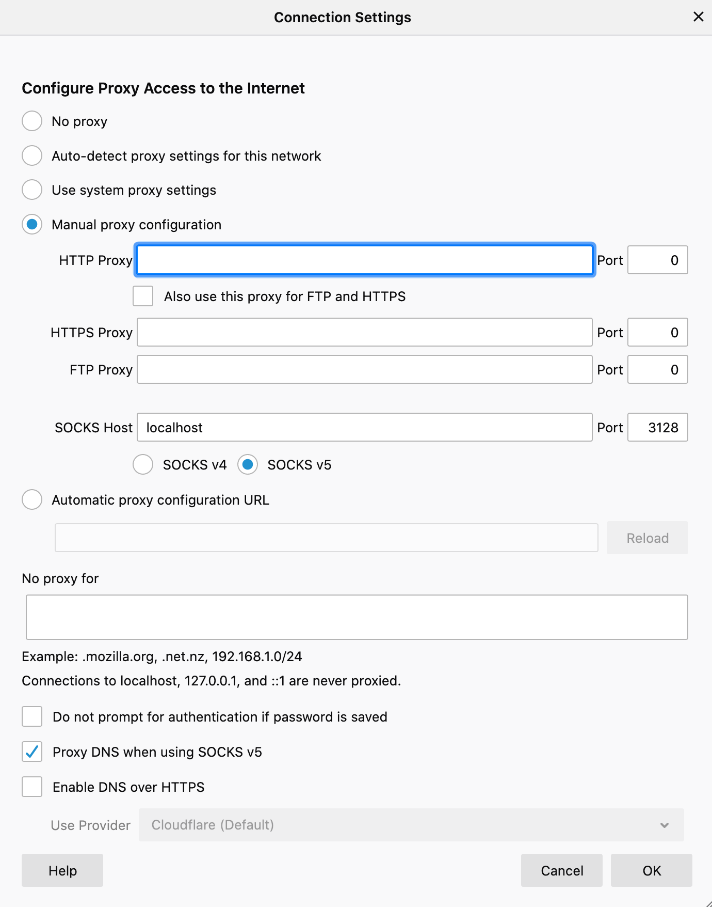

# Socks Proxy

A socks proxy is a useful tool to access applications on private networks or behind firewalls.

This will allow you to forward traffic from programs on your local machine (Browser, kubectl/oc, etc.) to remote machines, through an SSH tunnel. This can give you VPN-like functionality on an ad-hoc basis, with SSH being your only dependency.

A Socks Proxy will open an SSH tunnel to a remote machine, and a port on your local machine. When you configure an application to send traffic through your local port- the traffic will be forwarded to the remote machine and that machine will make the request on your local machine's behalf. The response will be forwarded back to your local machine through that same SSH tunnel.

## Use SSH to setup Socks Proxy

```
ssh -D -q 3128 ${USER}@${IP}
```

Access the machine through SSH like you usually would, but include the `-D` flag to bind the SOCKS proxy to port 3128 on your local machine. Any port will work as long as it isn't being used already- 3128 is arbitrary. The `-q` flag silences output related to the Socks Proxy so that this SSH session is still usable for other tasks.

If you're on a windows machine- you can setup a Socks Proxy using graphical tools such as PuTTY or mobaXterm

## Route browser traffic through Socks Proxy

I'll show an example of firefox- but most browsers are very similar. Navigate to preferences, network settings, and input localhost:3128 (or whatever port you used) as the Socks Proxy. Make sure to forward DNS traffic through the proxy as well.


If you're on a restricted local machine- sometimes proxy settings will be blocked on major browsers. You can use less popular browsers instead- like seamonkey from portableapps- to bypass this.

## Forward Kubectl/Oc and other CLI traffic through proxy

It's possible to still use your local terminal in air-gapped environments for many tasks by setting the `https-proxy` environment variable.

```
export https_proxy=socks5://localhost:3128
```

